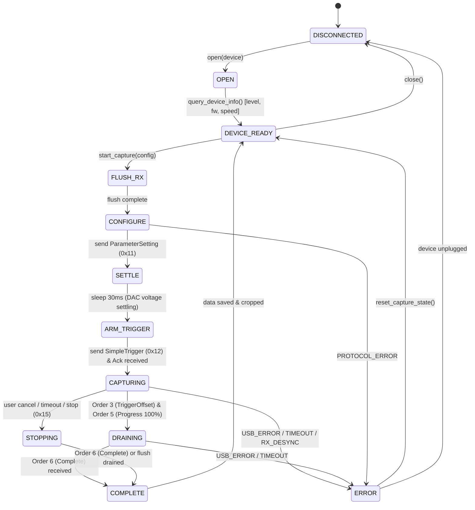

# ATK-DL16 Capture State Machine Specification

This document defines the formal capture state machine governing the `atk-dl16d` daemon and core library.

---

## 1. State Diagram



---

## 2. State Definitions & Transitions

| State | Description | Entry Action | Valid Next States |
| :--- | :--- | :--- | :--- |
| **`DISCONNECTED`** | No device handle acquired. Device is unreferenced or closed. | Release interface, close libusb device. | `OPEN`, `DISCONNECTED` |
| **`OPEN`** | Device handle acquired via `libusb_open()`, interface 0 claimed. | Set auto kernel detach, claim interface 0. | `DEVICE_READY`, `DISCONNECTED`, `ERROR` |
| **`DEVICE_READY`** | Device enumerated, MCU/FPGA versions identified, idle. | Clear internal queues, unlock capture pipeline. | `FLUSH_RX`, `DISCONNECTED` |
| **`FLUSH_RX`** | Pre-capture sanitization: reading and discarding stale USB buffers. | Loop `ReadSynchronous()` until buffer empty (max 50ms). | `CONFIGURE`, `ERROR` |
| **`CONFIGURE`** | Sending `ParameterSetting` (`0x11`) with sample rate, depth, threshold. | Send framed `0x11` command via Bulk OUT. | `SETTLE`, `ERROR` |
| **`SETTLE`** | Mandatory hardware DAC threshold voltage stabilization period. | Non-blocking or timer sleep of exactly **30 ms**. | `ARM_TRIGGER`, `ERROR` |
| **`ARM_TRIGGER`** | Sending `SimpleTrigger` (`0x12`) with channel triggers & instant flag. | Send framed `0x12` command and verify Ack (Order 4, status 3). | `CAPTURING`, `ERROR` |
| **`CAPTURING`** | Hardware actively recording into RAM/FIFO, streaming USB Bulk IN. | Start `ThreadRead` / Async Bulk IN transfers. | `DRAINING`, `STOPPING`, `ERROR` |
| **`DRAINING`** | Buffer capture finished or trigger reached 100%, draining residual samples. | Ingest remaining Bulk IN transfers until Order 6 received. | `COMPLETE`, `ERROR` |
| **`STOPPING`** | Aborting capture early or responding to client stop request. | Send framed `Stop` (`0x15`) command via Bulk OUT. | `COMPLETE`, `ERROR` |
| **`COMPLETE`** | Capture successful. Pre-trigger sample cropping applied. Store finalized. | Generate metadata, compute final sample range, release capture lock. | `DEVICE_READY` |
| **`ERROR`** | Exceptional condition encountered. | Cancel pending transfers, log error with code. | `DEVICE_READY`, `DISCONNECTED` |

---

## 3. Sequence Details & Implicit Hardware Dependencies

### 3.1 Why 30 ms Settle Delay is Mandatory
As audited in `Session::OrderStart` ([`pv/data/session.cpp:123`](file:///F:/Project/ATK-Logic-Mcp/upstream/atk-logic/pv/data/session.cpp#L123)):
```cpp
reft = usb->ParameterSetting((quint8*)setBytes.data(), setBytes.size());
if (reft) {
    QThread::msleep(30); // 两个指令之间要延迟一下，不然FPGA的电压没调整好
    reft = usb->SimpleTrigger((quint8*)dataBytes.data(), dataBytes.size());
}
```
The DL16 utilizes high-speed comparator circuits whose threshold voltages are programmed by a digital-to-analog converter (DAC) controlled by the FPGA. When `ParameterSetting` is issued, the DAC output slews to the target voltage (e.g. 1.6V or 3.3V). If trigger acquisition is armed immediately, the input comparator may false-trigger on the intermediate voltage slope. The 30 ms wait allows the threshold voltage and decoupling filters to fully stabilize.

### 3.2 Pre-Capture Flush Routine
Before any configuration, `FLUSH_RX` must drain the MCU/FPGA FIFO:
```text
while (ReadSynchronous(buffer, timeout=5ms) > 0) {
    discard(buffer);
}
```
This ensures no leftover packets from a prior aborted capture corrupt the stream parser.

### 3.3 Buffer Cropping & Trigger Alignment (Order 3 Policy)
When `Order 3` (`TriggerOffset`) arrives:
1. Extract `vernierTriggerPosition` ($T_{\text{offset}}$, 40-bit uint).
2. For each channel $i \in [0, \text{channels}-1]$:
   - Extract total channel bytes $C_i$.
   - Compute start sample offset:
     $$\text{startOffset}_i = \begin{cases} (C_i \times 8) - \text{TriggerSamplingDepth} - T_{\text{offset}}, & \text{if } C_i \times 8 > \text{SamplingDepth} \\ 0, & \text{otherwise} \end{cases}$$
3. When saving or presenting samples:
   - Discard the first $\lfloor \text{startOffset}_i / 8 \rfloor$ bytes.
   - Adjust bit index by $\text{startOffset}_i \pmod 8$.
   - The trigger event aligns deterministically at index $\text{TriggerSamplingDepth}$.

**Upstream Audit & Enforcement Policy**:
- In upstream `pv/thread/thread_work.cpp:230-315`, Order 3 is received asynchronously to calculate trigger alignment offsets. Upstream tracks `isOffsetOrder = true` to guard against duplicate Order 3 packets, but does not stall completion if Order 3 is absent.
- In `ATK-Logic-Mcp`: Duplicate Order 3 packets are guarded and logged as warnings. In Buffer mode with trigger offset, receiving Order 3 sets `trigger_offset_received = true`. If Order 3 is not received, but Order 6 Complete arrives and full sample depth is verified across all channels, capture completes without pre-trigger cropping (logging an explicit warning), preventing unnecessary deadlocks while preserving strict sample completeness verification.

### 3.4 Data Integrity & Unified RX Dispatch Contract
To eliminate false-positive capture completions, the pipeline enforces fail-closed evidence validation:
1. **Unified RX Dispatch & Order 4 ACK**: After issuing `SimpleTrigger` (`0x12`), the driver enters a unified RX message dispatch loop. Non-ACK messages (`ChannelData`, `TriggerOffset`, `Progress`) that arrive before or interleaved with `Order 4` ACK are ingested into sample storage without data loss. Capture cannot complete unless `trigger_ack_received == true` (`status == 3`, `CMD_SIMPLE_TRIGGER`).
2. **Order 6 Completion**: Buffer mode capture must terminate with a valid `Order 6` completion token from the hardware before finalizing.
3. **100% Channel Completeness**: Every enabled channel must deliver 100% of the requested sample depth (`actual_samples >= requested_samples`). Any channel delivering fewer samples than requested flags `DataIntegrity::Incomplete` and fails closed with `ErrorCode::IncompleteCapture`.
4. **Hardware Capacity Enforcement**: Captures exceeding hardware RAM (128 MB for DL16, 448 MB for DL16 Plus) fail immediately with `DataIntegrity::Overflow` rather than corrupting memory.
5. **Artifact Provenance & Save Validation**: Artifact storage writes `evidence_source: "REAL_HARDWARE"` into `meta.json` and verifies that all file streams (`.bits`, `edges.json`, `meta.json`) flush and close without I/O errors (`out.good() && !out.fail() && !out.bad()`). Write failures trigger `ErrorCode::ArtifactWriteError`.
6. **RFC 8259 JSON Escaping**: All JSON outputs from CLI serialize via `atkdl16::json_escape()`, ensuring Windows paths and special characters are parsed cleanly by MCP and external tools.

